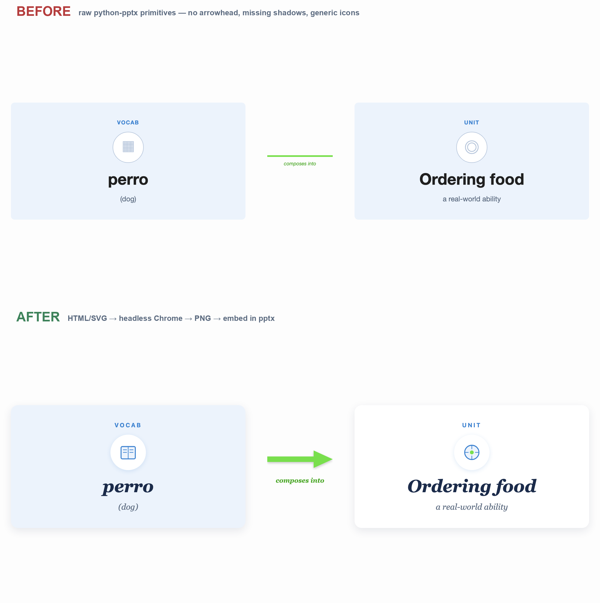

# polished-slide-visuals

A Claude Code / Claude Agent SDK **skill** for building designer-quality `.pptx` slides — real drop shadows, smooth bezier curves, gradient fills, true arrowheads, and rich SVG iconography — visual treatments that `python-pptx`'s native shapes can't render reliably once the deck is opened in Keynote or Google Slides.

It layers an **HTML/SVG → headless-Chrome PNG → python-pptx embed** pipeline on top of [Anthropic's existing `pptx` skill](https://github.com/anthropics/skills/tree/main/document-skills/pptx).



The two slides above have the same layout, colors, and content. The top is built with raw `python-pptx` primitives; the bottom embeds an HTML/SVG body. Look at the arrow, the shadows, the iconography, the typography.

---

## Why

If you've ever written a `python-pptx` script and then watched your design fall apart the moment someone opens it in Keynote or Google Slides, you've hit the wall this skill is for:

- `add_connector(2, …)` — meant to be an arrow — renders as a plain line with **no arrowhead** in Keynote and Google Slides.
- OOXML `<a:outerShdw>` drop shadows render fine in PowerPoint but degrade visibly in Keynote; the offset-rect hack everyone reaches for next looks like a ghost border.
- Smooth bezier decay curves (forgetting curves, growth charts) and gradient area fills aren't really expressible in `python-pptx`'s shape API.
- Real iconography needs vector control that the `MSO_SHAPE` catalog can't deliver.

This skill teaches Claude to **draw the body of any visually-rich slide as HTML + inline SVG**, render it to a PNG with headless Chrome, and embed the PNG into `python-pptx`. The headline, footer, and page number stay as native pptx text — editable in PowerPoint, but the visual heavy lifting is done in HTML where you have actual design tools.

Extracted from real work building a pedagogy deck for a Disney pedagogy team. Every recipe in `SKILL.md` is a thing I had to figure out the hard way — Keynote font scaling, flexbox stretch conditions, why global SVG-over-canvas connectors are fragile, etc.

---

## What's in here

```
polished-slide-visuals/
├── SKILL.md                    ← the skill itself (drop into ~/.claude/skills/)
├── README.md                   ← you are here
├── LICENSE                     ← MIT
└── examples/
    ├── example_body.html       ← a polished HTML slide body (the "AFTER" image)
    ├── example_body.png        ← rendered output (2200×1000)
    ├── build_demo.py           ← builds a 2-slide before/after .pptx
    ├── demo.pptx               ← the resulting deck (open it in Keynote!)
    ├── _before_mock.html       ← faithful mock of raw python-pptx output for comparison
    ├── before_after.png        ← the hero image at the top of this README
    └── _make_hero.py           ← stacks the before/after PNGs into the hero
```

---

## Install

### Option A — install as a Claude Code skill

```bash
git clone https://github.com/parahall/polished-slide-visuals.git ~/.claude/skills/polished-slide-visuals
```

That's it. Restart Claude Code if it was running; the skill registers from `~/.claude/skills/` automatically.

### Option B — copy the SKILL.md content into your own skill directory

If you already have a custom skills setup, just grab `SKILL.md` and drop it wherever your skills live. The skill is a single markdown file — no scripts or assets are required for it to work.

### Prerequisites the skill itself relies on

- **Python 3.10+** with `python-pptx` (`pip install python-pptx`)
- **Google Chrome** (for the headless rendering step) — already installed on most workstations
- **macOS Keynote** or **LibreOffice** (for the verification loop — exporting `.pptx` slides to PNG)
- **Anthropic's `pptx` skill** from <https://github.com/anthropics/skills>, for the deck-creation scaffolding (slides, headlines, page numbers). This skill layers on top of it.

---

## How it works (the short version)

1. **You write the slide body as HTML + inline SVG.** A 2200×1000 px canvas; Google Fonts; flexbox layout; real SVG icons; real arrows with `<marker>` arrowheads.
2. **Claude renders that HTML to a PNG via headless Chrome** — directly from `Bash`, not Playwright MCP. One command, no browser driver, no HTTP server.
3. **Claude embeds the PNG into a `python-pptx` slide** with `slide.shapes.add_picture(...)`. The headline, footer, and page number stay as editable pptx text on top.
4. **Verification loop:** export the `.pptx` to PNG via Keynote (AppleScript) or LibreOffice, downsample with `sips -Z 1800`, look at it. Browser previews lie about font scale and centering; the Keynote export is ground truth.

Concrete numbers the skill pins down (don't argue with them — they're load-bearing):

| Element                | Value                                  |
|------------------------|----------------------------------------|
| HTML canvas            | `2200 × 1000` px                        |
| Image embed in pptx    | `x=0.42, y=1.50, w=12.50, h=5.68` (inches) |
| Headline `y`           | `0.40` (pushed up from the natural 0.65) |
| HTML `.wrap` padding   | `25–30 px` (not the 50–80 you'd default to) |
| Font sizes             | bump 15–30% over what looks right in Chrome |

Read `SKILL.md` for the full rationale.

---

## Try the example

The `examples/` directory has a working end-to-end demo. From inside that directory:

```bash
# 1. Render the polished HTML body to a 2200×1000 PNG
"/Applications/Google Chrome.app/Contents/MacOS/Google Chrome" \
  --headless --disable-gpu --no-sandbox --hide-scrollbars \
  --screenshot=example_body.png --window-size=2200,1000 \
  file://$PWD/example_body.html

# 2. Build a 2-slide before/after .pptx (slide 1: raw pptx, slide 2: HTML/SVG embed)
python3 build_demo.py

# 3. Open it
open demo.pptx
```

Slide 1 will look like the top half of the hero image (broken arrow, missing shadows). Slide 2 will look like the bottom half. The skill is what teaches Claude how to author the slide-2 version automatically.

---

## When the skill triggers

The `SKILL.md` description is deliberately broad. It triggers when:

- You ask for a "polished deck", "modern presentation", "designer-quality slides", or "make this look better"
- You hand Claude a designer-provided color palette and ask for a deck that respects it
- You report that arrows or shadows look wrong after opening a `python-pptx` deck in Keynote / Google Slides
- You ask for slide visuals beyond plain text and bullet lists (diagrams, flows, icons, hub-and-spoke, layered shapes, charts)

It does **not** trigger for pure text extraction, bullet-only decks, deck-merging, or `pptx`-to-`pdf` conversion — for those, use Anthropic's `pptx` skill directly.

---

## License

MIT. See [`LICENSE`](LICENSE).

---

## Acknowledgements

Built on top of [Anthropic's `pptx` skill](https://github.com/anthropics/skills/tree/main/document-skills/pptx). Most of the heavy lifting for `.pptx` creation, slide layouts, and the Keynote/LibreOffice conversion workflow comes from there. This skill is a focused upgrade for the visual-quality dimension.
